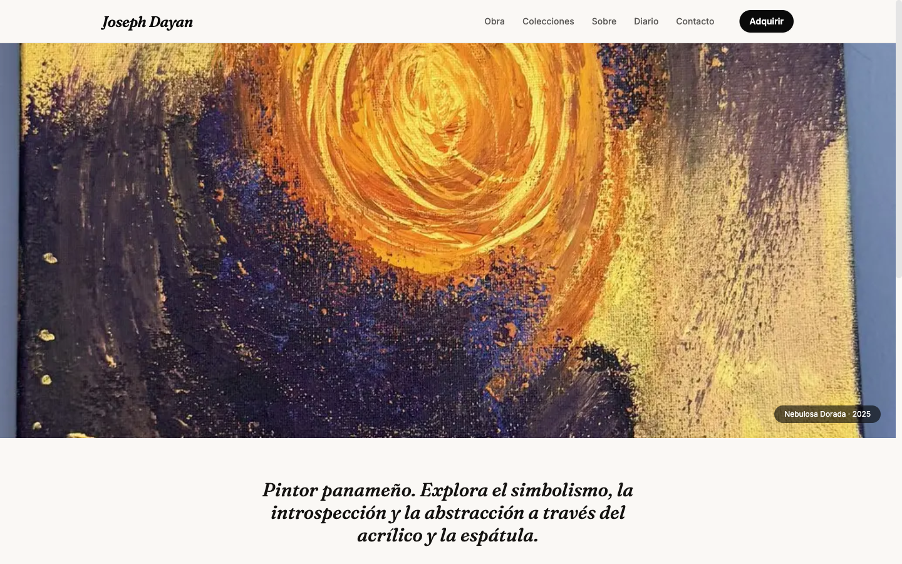
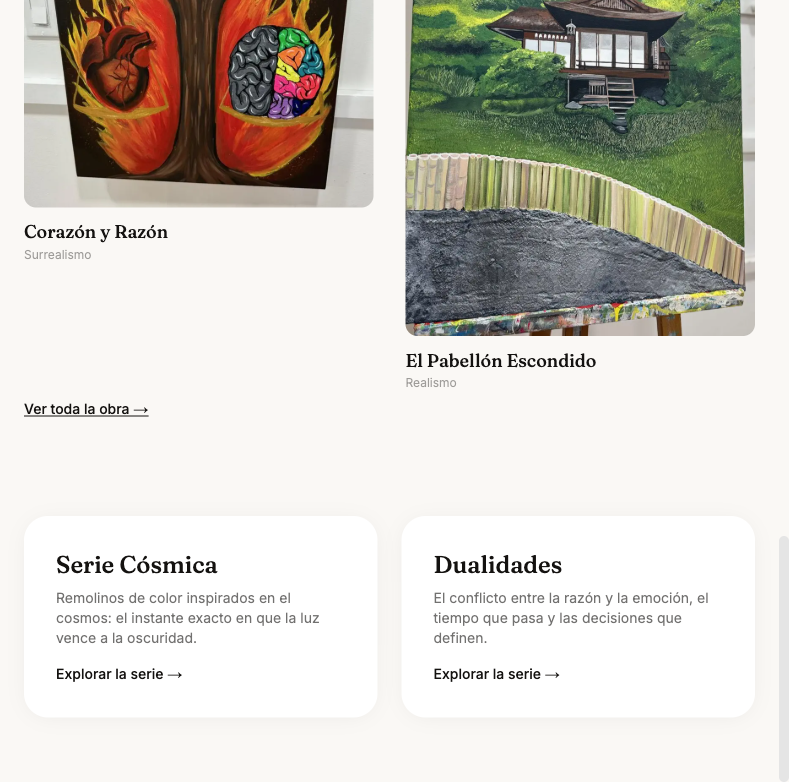
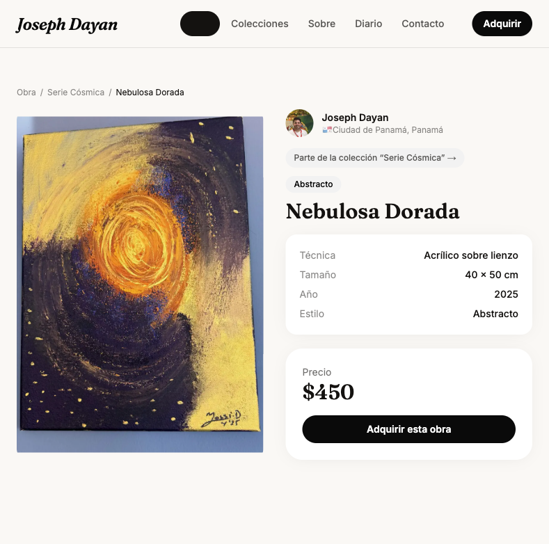
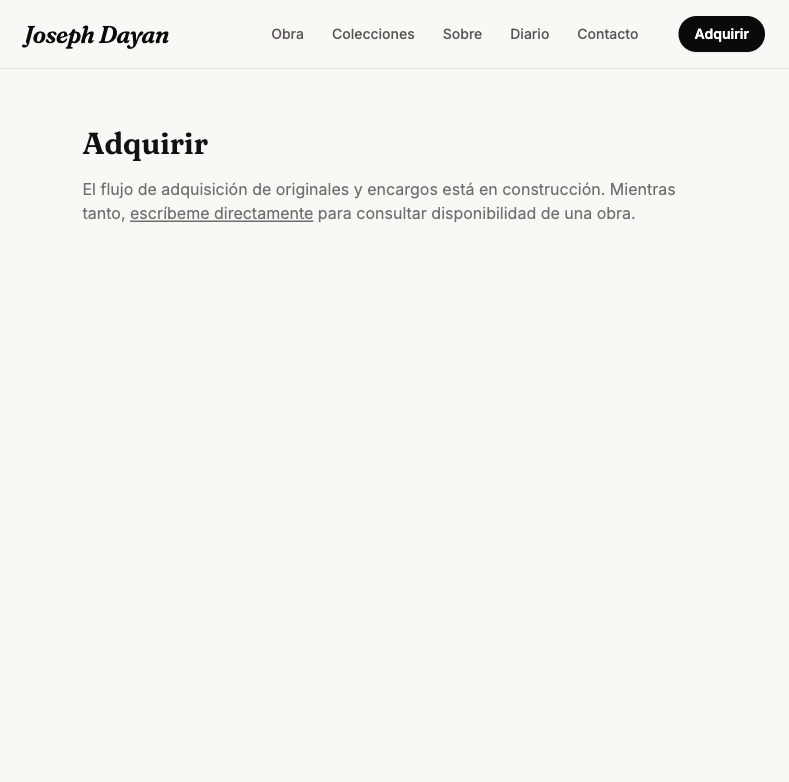
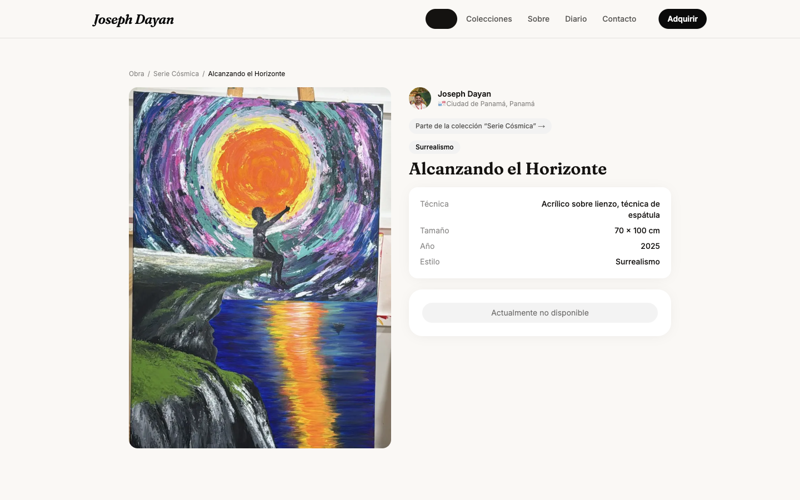
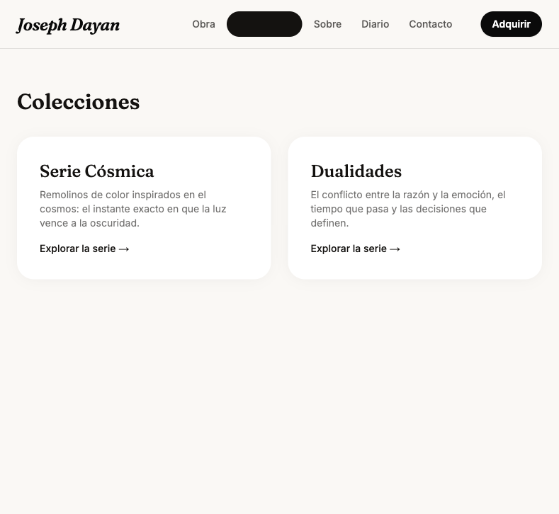
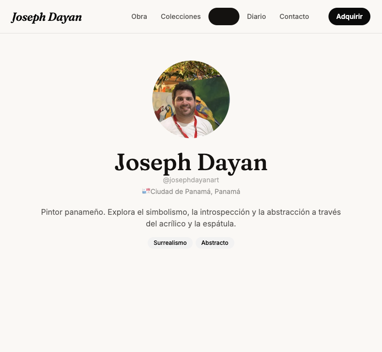
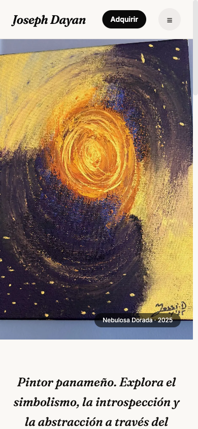

# Auditoría de Producto — Joseph Dayan Art en producción

Primera auditoría del sitio real y ya publicado
(`https://art-marketplace-ruddy.vercel.app`), navegado con un navegador real
(Playwright), no leído del código. Todo lo que sigue se verificó
interactuando con el sitio en vivo el 2026-07-20. Capturas de pantalla en
`docs/audit-2026-07-20/`.

---

## Resumen ejecutivo

El sitio es **técnicamente impecable y comercialmente incompleto**. La
navegación, el rendimiento (TTFB 59ms, primer contenido visible en 148ms),
la accesibilidad y el cuidado visual están al nivel que el Documento Maestro
prometía. Pero **cualquier visitante que decida comprar hoy choca contra una
página que dice "está en construcción"**, y cualquier galería o curador que
evalúe la trayectoria de Joseph encuentra una página `/sobre` casi vacía. El
producto vende la promesa de una práctica artística seria sin todavía
poder demostrarla ni monetizarla.

---

## Recorrido por página

### Home (`/`)

Hero de una sola obra a pantalla completa, statement breve, obra destacada
en masonry, entrada a colecciones. Visualmente el punto más fuerte del
sitio. Un detalle a considerar: el hero recorta la obra muy de cerca (zoom
alto sobre "Nebulosa Dorada") — es una elección editorial válida, pero un
visitante de primera vez no ve la composición completa de la pieza, solo un
fragmento. Vale la pena decidir si es intencional o si debería mostrar más
de la obra.

**Hallazgo funcional real:** la página termina abruptamente después de las
dos tarjetas de colección. No existe ningún footer — sin redes sociales,
sin copyright, sin acceso a la lista privada desde ahí, sin cross-link a
ColectArts. El Documento Maestro (sección 15) ya especifica qué debería
tener ("monograma, redes, lista privada, cross-link a ColectArts") — hoy no
existe en absoluto.

### Catálogo (`/obra`)

Filtro por estilo probado en vivo (clic en "Abstracto") — funciona
correctamente y de inmediato. El masonry con alturas reales (verificado con
scroll real, no con captura sintética) se ve exactamente como debería: cada
obra en su proporción real, sin recortes forzados.

### Detalle de obra (`/obra/[slug]`)

Cartela técnica clara, precio visible, Breadcrumb funcionando, lightbox
probado (abre, atrapa foco, `Escape` cierra) — todo correcto. El botón
"Adquirir esta obra" es el CTA principal de toda la página.

**El hallazgo más importante de toda la auditoría.** Al hacer clic en
"Adquirir esta obra" desde *cualquier* obra, se llega a una página genérica
que dice textualmente: *"El flujo de adquisición de originales y encargos
está en construcción. Mientras tanto, escríbeme directamente."* No hay
ningún contexto de qué obra quería comprar el visitante — ni el nombre, ni
el precio, ni siquiera un parámetro en la URL. Si el visitante sigue el
enlace a `/contacto`, el formulario tampoco recuerda nada: tiene que escribir
él mismo qué obra le interesaba. Un comprador real, con dinero listo para
gastar, se encuentra con una promesa rota justo en el momento de mayor
intención de compra.

`Actualmente no disponible` (obra sin precio, ej. "Alcanzando el
Horizonte") se maneja correctamente:

No hay CTA de compra cuando no corresponde — buen manejo del estado. Falta,
sí, cualquier forma de decir "avísame si esto cambia" (lista de espera) —
pero es una mejora menor comparada con el hallazgo anterior.

### Colecciones (`/coleccion`, `/coleccion/[slug]`)

Funciona, pero cada colección es solo texto — sin imagen de portada (el
campo `heroImage`/`coverImage` existe en el modelo de datos pero es `null`
para ambas colecciones). Comparado con las tarjetas de obra (que sí tienen
imagen), esta página es notablemente menos atractiva y podría pasar
desapercibida para un visitante que hace scroll rápido.

### Sobre (`/sobre`)

Foto, nombre, usuario, ubicación, la misma frase corta del hero de Home, dos
etiquetas de estilo. **Cero biografía extendida, cero exposiciones, cero
premios, cero prensa, cero declaración de práctica artística** — los
campos existen en el modelo de datos desde Fase C, todos `null` hoy. Una
galería o curador evaluando esta página no encuentra ninguna señal de
trayectoria.

### Diario (`/diario`)

Página vacía: *"Próximamente: notas de proceso, atelier y textos
curatoriales."* Está enlazada en la navegación principal — un visitante que
hace clic ve una página completamente en blanco. Vale la pena decidir si
debería seguir en el nav principal mientras no tenga contenido.

### Contacto (`/contacto`)

Probado en vivo, extremo a extremo, con datos reales: el formulario de
contacto envía correctamente (`"Mensaje enviado ✓"`) y la suscripción a la
lista privada también (`"¡Listo! Te avisaremos ✓"`). Ambas rutas de API
responden en producción sin errores. Punto positivo real: la infraestructura
básica de contacto funciona, aunque su presentación (Fase J, ya diseñada)
siga pendiente.

### Móvil

Nav responsivo, hero, tipografía y el detalle de obra se ven correctamente
en 390px de ancho. Sin problemas encontrados.

---

## Evaluación por perspectiva

**Como visitante:** experiencia pulida y rápida, pero el sitio se siente
nuevo — sin footer, sin bio, sin Diario, la primera impresión no sostiene
una segunda visita.

**Como coleccionista:** puede ver la obra con el cuidado prometido
(cartela, fotografía, precio), pero no tiene ninguna forma de reservar,
preguntar por disponibilidad futura, ni ver procedencia más allá de la
ficha técnica.

**Como comprador potencial:** este es el rol peor atendido del sitio hoy.
El CTA principal de cada página de obra lleva a una promesa rota. No hay
ningún camino de pago.

**Como galería:** buscaría exactamente lo que falta en `/sobre` —
exposiciones, prensa, representación previa. Hoy no encuentra nada.

**Como curador:** mismo hallazgo que la galería, más el hecho de que
`/diario` (el lugar pensado para textos curatoriales) está vacío.

---

## Errores encontrados

- Cero errores de consola en ninguna página visitada (Home, catálogo,
  detalle, colecciones, sobre, diario, contacto, móvil).
- Cero errores de build o de red (todas las páginas y ambos formularios
  respondieron `200`/éxito).
- El único "error" real es de producto, no técnico: la promesa rota de
  "Adquirir esta obra".

---

## Las 10 mejoras de mayor impacto

1. **Comercio real (Stripe Checkout).** Cierra la brecha más grave
   encontrada en esta auditoría — confirma exactamente lo ya identificado
   en `docs/PRODUCT-ROADMAP.md` (v1.2), ahora con evidencia visual directa.
2. **Footer completo** (redes, copyright, lista privada, cross-link a
   ColectArts). Hallazgo nuevo de esta auditoría — no estaba explícito en
   el roadmap anterior con este nivel de detalle visual.
3. **Contenido real en `/sobre`** (biografía, exposiciones, prensa). Ya
   identificado en el roadmap (v1.3), confirmado visualmente como una
   página casi vacía.
4. **Contexto de la obra en el flujo de "Adquirir"** — como mínimo, que
   `/adquirir` y el formulario de contacto sepan qué obra motivó el clic
   (parámetro de URL + campo prellenado), incluso antes de tener Stripe.
   Es una mejora barata que reduce fricción mientras se construye el
   comercio real.
5. **Imágenes de portada para las colecciones.** Bajo esfuerzo (los campos
   ya existen en el modelo de datos), alto impacto visual inmediato.
6. **Dominio propio.** Ya identificado en el roadmap (v1.1) — esta
   auditoría no agrega evidencia nueva, solo confirma que sigue siendo
   igual de urgente vista desde la experiencia real.
7. **Prints numerados (Printful).** Segunda línea de precio de entrada, ya
   en el roadmap (v1.3).
8. **Decisión sobre `/diario` en la navegación principal** mientras no
   tenga contenido — ocultarlo del nav o poblarlo, pero no dejarlo enlazado
   y vacío.
9. **Formularios con feedback vía Toast** en vez de texto plano
   condicional (Fase J) — funcionan hoy, pero la experiencia de éxito/error
   es mínima.
10. **Lista de espera / "avísame" en obras no disponibles** — mejora menor
    pero coherente con la relación de largo plazo que el Documento Maestro
    ya define como modelo de negocio.

## Esta semana

- Footer completo (#2) — bajo esfuerzo, alto impacto, no depende de Joseph.
- Contexto de la obra en el flujo de "Adquirir" (#4) — bajo esfuerzo,
  reduce fricción de inmediato mientras se construye Stripe.
- Imágenes de portada para colecciones (#5) — bajo esfuerzo, alto impacto
  visual, no depende de integraciones externas.
- Decisión sobre `/diario` en el nav (#8) — es literalmente una decisión,
  no una construcción.

## Puede esperar

- Comercio real (#1) y Prints (#7) — alto impacto pero alto esfuerzo,
  dependen de integraciones externas (Stripe/Printful) que no se resuelven
  en días.
- Contenido real de `/sobre` (#3) — depende de que Joseph provea el
  contenido, no de ingeniería.
- Dominio propio (#6) — depende de una decisión/compra externa, no de
  código.
- Toast en formularios (#9) y lista de espera (#10) — mejoras reales pero
  de menor urgencia que las anteriores.

---

## Calificación general: **6.5 / 10** (como usuario, no como desarrollador)

La experiencia de navegación, velocidad y cuidado visual son de 9/10 — muy
por encima de lo que un sitio de artista independiente suele ofrecer. Pero
un producto se juzga por si cumple su propósito central, y el propósito
central de este sitio es que alguien pueda **conocer y adquirir** la obra
de Joseph Dayan. Hoy se puede conocer muy bien; no se puede adquirir en
absoluto, y la credibilidad institucional (`/sobre`, `/diario`) todavía no
respalda la narrativa de "artista ya reconocido" que el propio sitio
proyecta visualmente. La nota refleja eso: una base sobresaliente a la que
le falta la mitad de su propósito.
